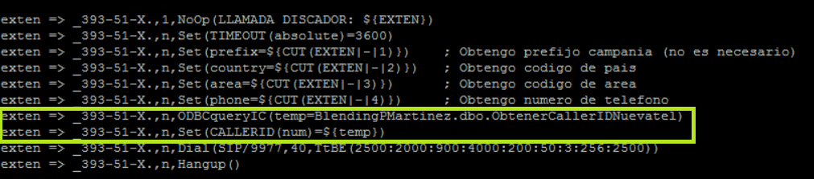

# PROCESO ROTACIÓN DE CABECERAS - MANTENIMIENTO

El proceso de rotación de cabeceras consiste en definir un listado de Caller IDs que serán asignados aleatoriamente en las llamadas salientes, el proceso contiene un formulario genérico que permite al cliente agregar y eliminar Caller IDs según lo requiera.

Los pasos son los siguientes:

## 1. Creación de tabla Caller ID y store procedure de consulta

En la BD de Negocio, se deberá crear la tabla Caller ID que contendrá el listado de Caller IDs a usar, así como el store procedure que se consultará desde la PBX para obtener un Caller ID aleatorio de la lista. Para esto, se deben ejecutar las querys del archivo **querys.sql**

## 2. Validación de la existencia de ODBC en la PBX

Se debe validar si es que la PBX donde se usará el proceso tiene instalado ODBC, el cual permite ejecutar store procedures desde Asterisk. Se deben ejecutar los siguientes comandos y verificar que la IP corresponde al servidor de la base de datos del punto 1 (la base que usa por defecto es MMProdat, la tabla y sp del punto 1 no necesariamente deben estar en la MMProdat, puede estar en otra BD del mismo servidor):
 
```
nano /usr/local/etc/odbc.ini
nano etc/asterisk/odbcexec.conf
```
En caso no existan estos archivos o la configuración no sea la deseada, se debe consultar la siguiente guía para realizar la instalación o cambios correspondientes:

[https://inconcert.atlassian.net/wiki/spaces/allegroDocs/pages/6651926/C+mo+ejecutar+un+Stored+Procedure+desde+el+dialplan+de+Asterisk]

## 3. Adición de obtención de Caller ID en el archivo extensions.conf de la PBX

El siguiente paso es agregar la consulta a la BD desde el archivo **/etc/asterisk/extensions.conf** de la PBX, para ello se tiene que usar ODBCquery para poder ejecutar el store procedure desde la PBX:

**exten => _393-51-X.,n,ODBCqueryIC(temp=BlendingPMartinez.dbo.ObtenerCallerIDNuevatel)**

**exten => _393-51-X.,n,Set(CALLERID(num)=${temp})**

Recordar que una vez realizados los cambios se debe recargar el dialplan:
 
```
asterisk -rx 'extensions reload'
```

Por ejemplo, esta campaña tiene una configuración de rotación de cabeceras en su dialplan:



## 4. Creación de formulario de mantenimiento

Se debe subir a OCC el formulario genérico llamado **FormMantenimientoCabeceras.bundle**

Recordar que se debe actualizar la fuente de datos CallerID con las credenciales que corresponda.

Finalmente se debe habilitar el formulario genérico en el **Iniciador de Aplicaciones** de OCC para que el cliente pueda acceder fácilmente.


